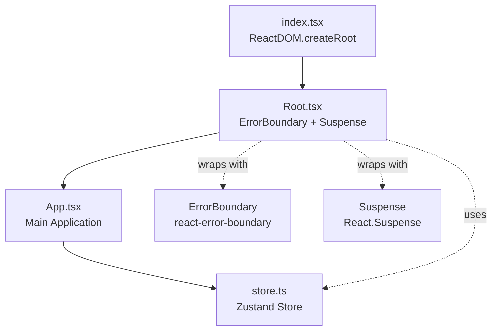

# Todo app project

This is a simple application I made to learn React basics. It lets you manage your tasks and keep them stored in a REST API.

## Key features

- **Full CRUD Operations**: Seamlessly create, read, update, and delete tasks.
- **Global State Management**: Powered by Zustand for lightweight, scalable, and reactive state handling.
- **Persistent Storage**: Tasks are securely synced and stored via a REST API.
- **Advanced Sorting & Filtering**: Organize your workflow by filtering and sorting tasks simultaneously.

## Setup

Make sure you have `pnpm` installed.

Install the dependencies:

```bash
pnpm install
```

## Get started

Start the dev server, and the app will be available at [http://localhost:3000](http://localhost:3000).

```bash
pnpm run dev
```

Build the app for production:

```bash
pnpm run build
```

Preview the production build locally:

```bash
pnpm run preview
```

## Application Flow


## Learn more

To learn more about Rsbuild, check out the following resources:

- [Rsbuild documentation](https://rsbuild.rs) - explore Rsbuild features and APIs.
- [Rsbuild GitHub repository](https://github.com/web-infra-dev/rsbuild) - your feedback and contributions are welcome!
